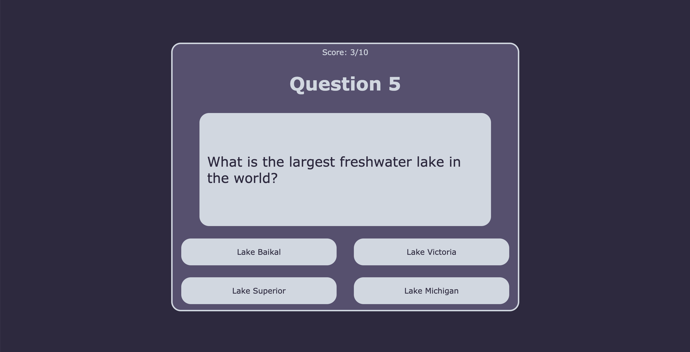
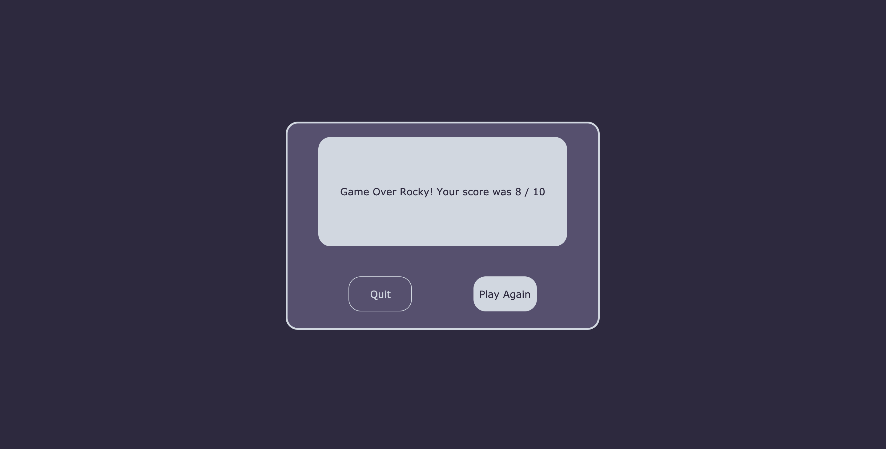

# Ultimate Trivia
A trivia game application that prompts users to answer 10 multiple choice questions.

# Live Link
<a href="https://ultimatetrivia.herokuapp.com/">LIVE LINK</a>

# Technologies
- Front-end development
    - React
    - CSS
    - HTML
    - JavaScript
  

 # Features
- Landing Page

- Trivia Question

- Prompts user to play again or quit when the round is finished

# Assumptions from Tandem
- A round of trivia has 10 questions
- All questions are multiple-choice questions
- Score does not need to update in real time.  (This application updates scores in real time)
- Results can update on form submit, button click, or any interaction

# Acceptance Criteria
- A user can view questions.
- Questions with their multiple choice options must be displayed one at a time.
- Questions should not repeat in a round.
- A user can select only 1 answer out of the 4 possible answers
- The correct answer must be revealed after a user has submitted their answer.
- A user can see the score they received at the end of the round.

# Technical Challenges

### Front-End
- Using Custom CSS
- Implementing modals into pages
- Figuring out to get the answers displayed in different spots
- Having a round not repeating questions

This project was bootstrapped with [Create React App](https://github.com/facebook/create-react-app).

## Available Scripts

In the project directory, you can run:

### `npm start`

Runs the app in the development mode. 
Open [http://localhost:3000](http://localhost:3000) to view it in the browser.

The page will reload if you make edits. 
You will also see any lint errors in the console.